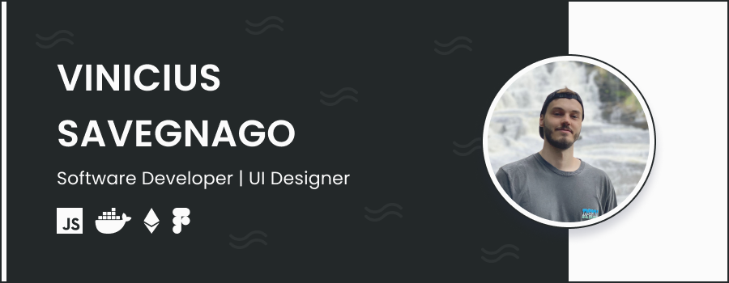

[

](https://vinisaveg.com)

## Hey, I'm Vinicius, aka Vini. 👋

I'm 27 years old, graduated Web Developer from Senac University. I have been studying the software ecosystem since 2019, building websites, landing pages, e-commerce platforms and other applications.

### Passions :heartpulse:

My family, friends, sports, eSports and building software.

### Let's code together! :punch:

One of the best things we can do is type together. Sharing experiences, solving problems, errors and creating awesome stuff as a team. Get in touch with me in any social media, and let's work together!

### Contact me :speech_balloon:

- **[Instagram](https://www.instagram.com/vinisaveg)**
- **[LinkedIn](https://www.linkedin.com/in/vinicius-savegnago-silva/)**
- **[Behance](https://www.behance.net/vinisaveg)**
- **[Website](https://www.vinisaveg.com)**
- **[Twitch](https://www.twitch.tv/vinisaveg/about)**
- **[Youtube](https://www.youtube.com/channel/UCmXwSTz2OD_e6L981xCt0Cg)**

### Last posts :star:

- [Crie seu próprio template customizado para seus apps Reactjs](https://dev.to/vinisaveg/crie-seu-proprio-template-customizado-para-seus-apps-reactjs-3d1a)
- [Tema customizado para o Visual Studio Code](https://dev.to/vinisaveg/tema-customizado-para-o-visual-studio-code-3d34)
- [Consumindo uma API GraphQL com SWR](https://dev.to/vinisaveg/consumindo-uma-api-graphql-com-swr-4ejo)
- [Meu Boilerplate Fullstack](https://dev.to/vinisaveg/meu-boilerplate-fullstack-3bdp)
- [Análise de Performance com Lighthouse e Github Actions](https://dev.to/vinisaveg/analise-de-performance-com-lighthouse-e-github-actions-5ggj)

&nbsp;

